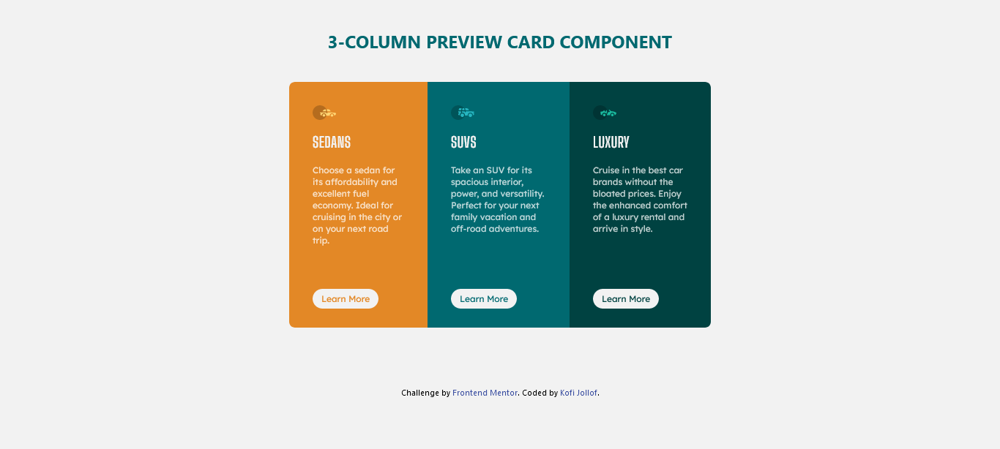

# Frontend Mentor - 3-column preview card component solution

This is a solution to the [3-column preview card component challenge on Frontend Mentor](https://www.frontendmentor.io/challenges/3column-preview-card-component-pH92eAR2-). Frontend Mentor challenges help you improve your coding skills by building realistic projects. 

## Table of contents

- [Overview](#overview)
  - [The challenge](#the-challenge)
  - [Screenshot](#screenshot)
  - [Links](#links)
- [My process](#my-process)
  - [Built with](#built-with)
- [Author](#author)

## Overview

### The challenge

Users should be able to:

- View the optimal layout depending on their device's screen size
- See hover states for interactive elements

### Screenshot

### Links

- [Solution](https://www.frontendmentor.io/solutions/responsive-3column-preview-card-component-bgJa_f37U)
- [Live Site](https://three-column-fm.netlify.app/)

### Built with

- Semantic HTML5 markup
- Tailwindcss
- Flexbox

## Author

- Frontend Mentor - [@guytito](https://www.frontendmentor.io/profile/guytito)
- Twitter - [@i_jollof](https://www.twitter.com/i_jollof)

