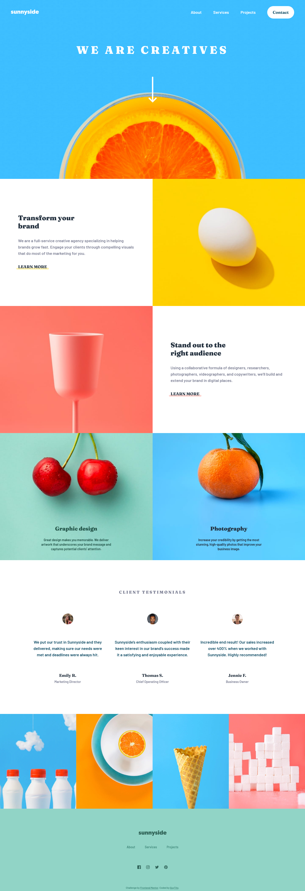

# Frontend Mentor - Sunnyside agency landing page solution

This is a solution to the [Sunnyside agency landing page challenge on Frontend Mentor](https://www.frontendmentor.io/challenges/sunnyside-agency-landing-page-7yVs3B6ef). Frontend Mentor challenges help you improve your coding skills by building realistic projects.

## Table of contents

- [Overview](#overview)
  - [The challenge](#the-challenge)
  - [Screenshot](#screenshot)
  - [Links](#links)
  - [Built with](#built-with)
- [Author](#author)

## Overview

### The challenge

Users should be able to:

- View the optimal layout for the site depending on their device's screen size
- See hover states for all interactive elements on the page

---

### Screenshot

Screenshot

---

### Links

- [Solution](https://your-solution-url.com)
- [Live Site](https://sunny-page-fm.netlify.com)

---

### Built with

- Semantic HTML5 markup
- Tailwindcss
- Flexbox
- CSS Grid
- Mobile-first workflow

---

## Author

- Frontend Mentor - [@guytito](https://www.frontendmentor.io/profile/guytito)
- Twitter - [@i_jollof](https://www.twitter.com/i_jollof)
