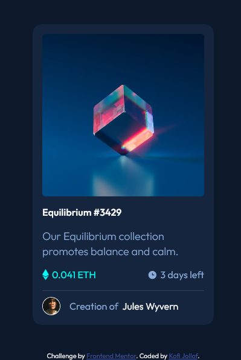

# Frontend Mentor - NFT preview card component solution

This is a solution to the [NFT preview card component challenge on Frontend Mentor](https://www.frontendmentor.io/challenges/nft-preview-card-component-SbdUL_w0U). Frontend Mentor challenges help you improve your coding skills by building realistic projects. 

## Table of contents

- [Overview](#overview)
  - [The challenge](#the-challenge)
  - [Screenshot](#screenshot)
  - [Links](#links)
- [My process](#my-process)
  - [Built with](#built-with)
  - [What I learned](#what-i-learned)
- [Author](#author)


## Overview

### The challenge

Users should be able to:

- View the optimal layout depending on their device's screen size
- See hover states for interactive elements

### Screenshot



### Links

- [Solution](https://www.frontendmentor.io/solutions/a-simple-card-component-using-html-and-css-qHwN0Mijo)
- [Live Site](https://nft-card-fm.netlify.app/)

## My process

### Built with

- HTML
- CSS

### What I learned

Hovering over a parent element to trigger a child element. This was applied when i was making the active state when a user hovers the equilibrium image, a green overlay with an icon appear ontop of it.

```css
.hero:hover .overlay{
  display: block;
}
```


## Author

- Twitter - [@i_jollof](https://www.twitter.com/i_jollof)
- Frontend Mentor - [@yourusername](https://www.frontendmentor.io/profile/yourusername)


