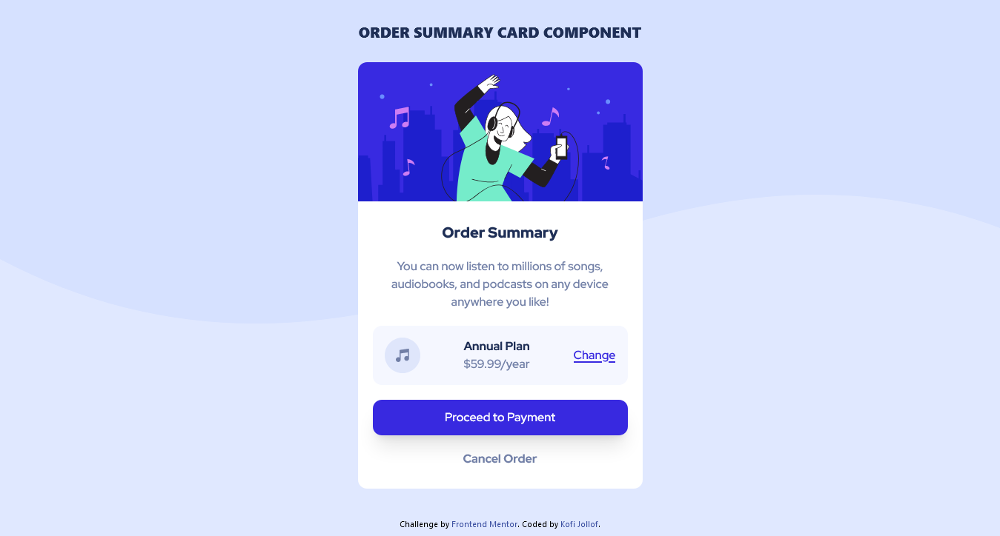

# Frontend Mentor - Order summary card solution

This is a solution to the [Order summary card challenge on Frontend Mentor](https://www.frontendmentor.io/challenges/order-summary-component-QlPmajDUj). Frontend Mentor challenges help you improve your coding skills by building realistic projects. 

## Table of contents

- [Overview](#overview)
  - [The challenge](#the-challenge)
  - [Screenshot](#screenshot)
  - [Links](#links)
- [My process](#my-process)
  - [Built with](#built-with)
  - [What I learned](#what-i-learned)
- [Author](#author)


## Overview

### The challenge

Users should be able to:

- See hover states for interactive elements

### Screenshot



### Links

- Solution URL: [Add solution URL here](https://your-solution-url.com)
- Live Site URL: [Add live site URL here](https://your-live-site-url.com)

## My process

### Built with

- Semantic HTML5 markup
- Tailwindcss


### What I learned

I learned to switch background images responsively using media queries

```css
  @media (min-width: 376px) {
    .bg-pattern {
      background-image: url(./images/pattern-background-desktop.svg);
      background-repeat: no-repeat;
    }
  }
  @media (max-width: 376px) {
    .bg-pattern {
      background-image: url(./images/pattern-background-mobile.svg);
      background-repeat: no-repeat;
    }
  }
```

## Author

- Frontend Mentor - [@guytito](https://www.frontendmentor.io/profile/guytito)
- Twitter - [@i_jollof](https://www.twitter.com/i_jollof)

